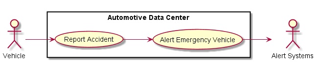
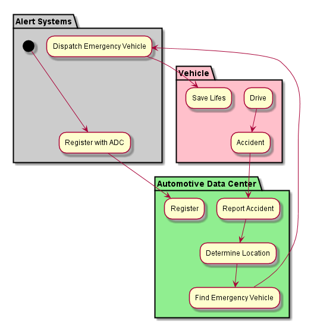
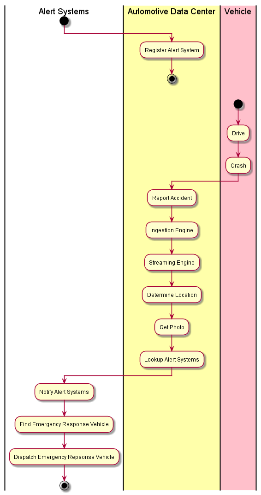

.. _Actor-Alert-Systems:

Alert Systems
=============

Alert Systems are systems that include emergency response vehicles or any system that is alerted
when vehicles undergo some kind of event, typically dramatic event like and accident.
The goal is to have an emergency vehicle respond to the accident in less than 7 minutes from
the time that the car is in an accident including sending picture(s) to the emergency
response vehicle.

Use Cases
---------

* :ref:`UseCase-Report-Accident`
* :ref:`UseCase-Alert-Emergency-Vehicle`

Activities
----------

The Alert System registers itself with the Automotive Data Center so it can be notified when
there is an accident.

When a car crashes it sends a message to the Automotive Data Center notifying the ADC of
the location, a photo and the number of people in the car.

Workflow
--------

The Alert System registers itself with the ADC. It holds the location of its own Emergency
Response Vehicles in its own database.

When a car crashes it sends information (Location, Status of the car, number of people, photo,...)
to the ADC through the ingestion engine. The message is then streamed through the system and
the registered Alert Systems are notified of the accident and the location of the crash.
The Alert System then dispatches the closest Emergency Repsonse Vehicles to the crash.

User Interface
--------------

TBD

Command Line Interface
----------------------
**Register an Alert System with the Automotive Data Center**

.. code-block:: none

    # adc alertSystem register <url>

**De-Register an Alert system from the Automotive Data Center**

.. code-block:: none

    # adc alertSystem deregister <url>
