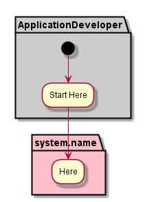

.. _Application-Developer:

Actor Application Developer
===========================

Application Developers develop new applications in the Automotive Data Center. They will
use the Application Development Framework to register new applications that may include
Analytics, AI, Streaming, Notification and Application Data Store SubSystems. The Application
Developer will follow the development guidelines and patterns for the Automotive Data Center.

Use Cases
---------
The Use Casees for the Application Developer are the same as the Common Cloud Core
`Application Developer <http://c3.readthedocs.io/en/latest/Actors/ApplicationDeveloper/Actor-ApplicationDeveloper.html>`_.
A more extensive set of Use Cases can be found there.

* :ref:`UseCase-Manage-Applications`

Activities
----------

Application Developers will develop applications for the Automotive Data Center by developing
their own services in conjunction with the Services already available in the Service Stack.
Specific Services like Ingestion Engine and Connection Services should be reused and not
replaced.

Workflow
--------

Look at the application Developer Use Cases and work flows on the
`Common Cloud Core <http://c3.readthedocs.io/en/latest/Actors/ApplicationDeveloper/Actor-ApplicationDeveloper.html>`_.

User Interface
--------------

TBD

Command Line Interface
----------------------

TBD
