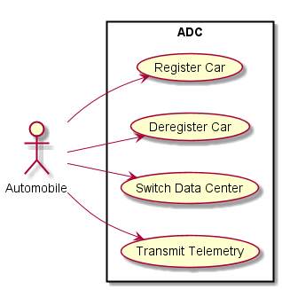
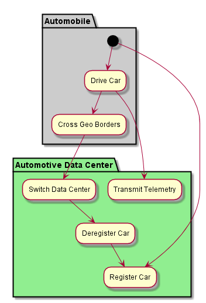
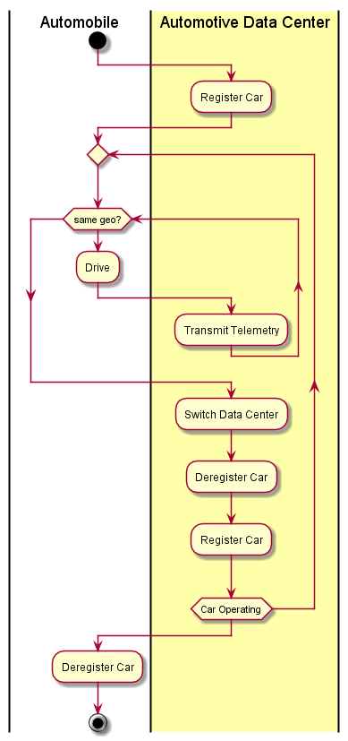

.. _Automobile:

Actor Automobile
================

This is a automobile that has been registered to a Automotive Data Center. It will send
telemetry from the car to the ADC every minute. The size of the telemetry package can
vary but should be around 200K Bytes per message.

Use Cases
---------

* :ref:`UseCase-Register-Car`
* :ref:`UseCase-Deregister-Car`
* :ref:`UseCase-Switch-Data-Center`
* :ref:`Transmit Telemetry`

Activities
----------

When a car is driving it will send telemetry about the conditions of the car's sensors once
every minute. The estimated packet size is about 200K. There are times when the car will
have to switch from one data center to another. This may include moving across geographical
boarders, downtime or congestion in a data center etc... This should be handled from
data transport layer of the system.

Workflow
--------

User Interface
--------------

TBD

Command Line Interface
----------------------

TBD
