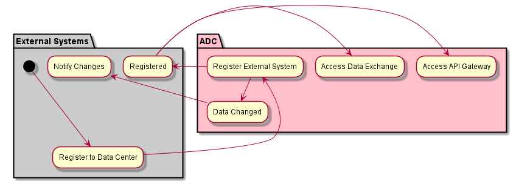

.. _Actor-External-Systems:

External Systems
================
This is an external system to the Data Center. This could be a customer of the owner of the data center getting access
to the data through the :ref:`SubSystem-API-Gateway`, :ref:`SubSystem-Data-Exchange`, :ref:`SubSystem-Notification-Gateway`
or any other service in the :ref:`SubSystem-Connection-Services`. There are several different reasons that an external
system connects to the Data Center. But mostly for data from the data center. Compliance, Auditability, Control, and Security
are key aspects of allowing external systems to connect to the Data Center.

Use Cases
---------

.. image:: UseCases.png

Activities
----------

* :ref:`Scenario-Register-External-System`
* :ref:`Scenario-Notify-of-Changes`
* :ref:`Scenario-Register-API-Gateway`
* Access API Gateway
* Access Data Exchange

Workflow
--------

.. image:: Workflow.png

User Interface
--------------

TBD

Command Line Interface
----------------------

:ref:`Scenario-Register-External-System`
~~~~~~~~~~~~~~~~~~~~~~~~~~~~~~~~~~~~~~~~
This registers an external system with the specific type of registration (notify,exchange,api).
If the type is not specified api is assumed.
For data exchange and api types a URI end point is returned.

.. code-block:: none

    # adc external register --url <url> --type <type>

:ref:`Scenario-Deregister-External-System`
~~~~~~~~~~~~~~~~~~~~~~~~~~~~~~~~~~~~~~~~~~
This deregisters an external system with the specific type of registration (notify,exchange,api)
from the Automotive Data Center. If the type is not specified api is assumed.

.. code-block:: none

    # adc external deregister --url <url> --type <type>

