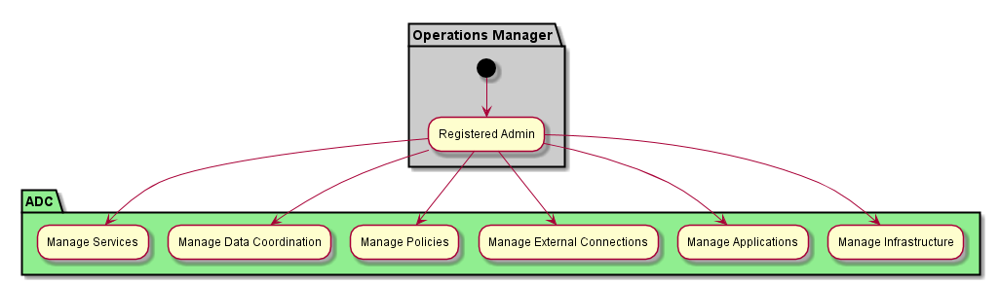
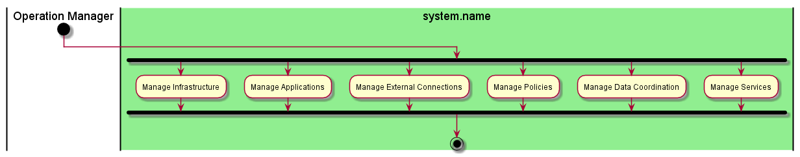

.. _Actor-Operations-Manager:

Operations Manager
==================

The Operations Manager manages the Infrastructure and monitors the services and applications.
The `Common Cloud Core <http://c3.readthedocs.io>`_ architecture has a extended
description of the `Operations Manager <http://c3.readthedocs.io/en/latest/Actors/OperationsManager/Actor-OperationsManager.html>`_
Use Cases and Activities.

Use Cases
---------

* :ref:`UseCase-Manage-Infrastructure`
* :ref:`UseCase-Manage Infrastructure`
* :ref:`UseCase-Manage Applications`
* :ref:`UseCase-Manage External Connections`
* :ref:`UseCase-Manage Policies`
* :ref:`UseCase-Manage Data Coordination`
* :ref:`UseCase-Manage Services`

Activities
----------

Workflow
--------

The `Common Cloud Core <http://c3.readthedocs.io>`_ architecture has details about the
`Operations Manager <http://c3.readthedocs.io/en/latest/Actors/OperationsManager/Actor-OperationsManager.html>`_.
Please follow the links to get more information.

User Interface
--------------

TBD

Command Line Interface
----------------------

See `C3 commandline interface <http://c3.readthedocs.io/en/latest/Actors/OperationsManager/Actor-OperationsManager.html>`_.

