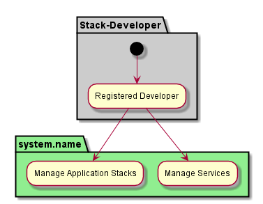

.. _Stack-Developer:

Actor Stack-Developer
=========================

The Stack Developer developers reuseable services and stacks of services that are used by
the Application Developers. They can also be Services that can be used by External systems
through the connection Services like the Notification Gateway and API Gateway.
The `Common Cloud Core <http://c3.readthedocs.io>`_ architecture has extended documentation
of the `Stack Developer <http://c3.readthedocs.io/en/latest/Actors/StackDeveloper/Actor-StackDeveloper.html>`_.

Use Cases
---------

These are the basic use cases for the stack developer. Extended Use Cases can be found in the
`Common Cloud Core <http://c3.readthedocs.io>`_ architecture through the Actor
`Stack Developer <http://c3.readthedocs.io/en/latest/Actors/StackDeveloper/Actor-StackDeveloper.html>`_.

* :ref:`UseCase-Manage-Services`
* :ref:`UseCase-Manage-Application-Stack`

Activities
----------

Workflow
--------

User Interface
--------------

TBD

Command Line Interface
----------------------

TBD

