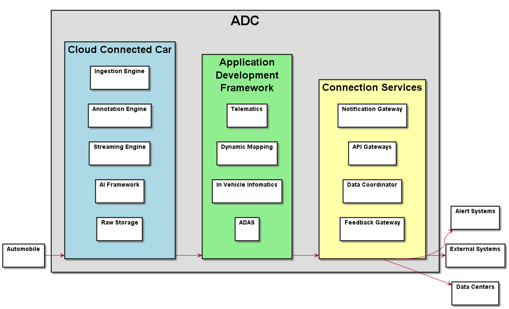
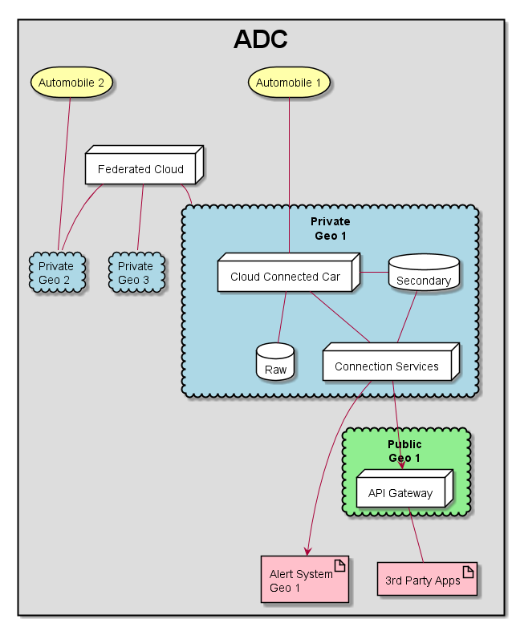

Automotive Data Center Overview
===============================

The Automotive Data Center is developed to handle new and existing use cases of the automotive
industry include but not limited to Autonomous Driving (ADAS), Telemetry, Alert Systems, and
new usage models that have not been yet developed to monetize data.

High level Use Cases
--------------------

* :ref:`UseCase-ADAS`
* :ref:`UseCase-Alert-Emergency-Vehicle`
* :ref:`UseCase-Deregister-Car`
* :ref:`UseCase-Dynamic-Mapping`
* :ref:`UseCase-In-Vehicle-Infomatics`
* :ref:`UseCase-Manage-Applications`
* :ref:`UseCase-Manage-Application-Stack`
* :ref:`UseCase-Manage-Cloudlets`
* :ref:`UseCase-Manage-Data-Coordination`
* :ref:`UseCase-Manage-Data-Exchange`
* :ref:`UseCase-Manage-External-Connections`
* :ref:`UseCase-Manage-Infrastructure`
* :ref:`UseCase-Manage-Policies`
* :ref:`UseCase-Manage-Security`
* :ref:`UseCase-Manage-Services`
* :ref:`UseCase-Register-Car`
* :ref:`UseCase-Report-Accident`
* :ref:`UseCase-Switch-Data-Center`
* :ref:`UseCase-Transmit-Telemetry`

Users
-----

* :ref:`Actor-Alert-Systems`
* :ref:`Actor-Application-Developer`
* :ref:`Actor-Automobile`
* :ref:`Actor-External-Systems`
* :ref:`Actor-Operations-Manager`
* :ref:`Actor-Stack-Developer`

.. image:: UseCases/UseCases.png

Logical Architecture
--------------------

Process Architecture
--------------------

.. image:: Solution/Process.png

Deployment model
----------------

Physical Architecture
---------------------

.. image:: Solution/Physical.png

