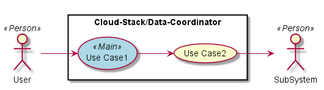
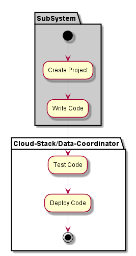

.. _SubSystem-Data-Coordinator:

Data Coordinator
================

Data Coordinator is a subsystem of ADC and is responsible for coordinating data between
the data centers. This is for Data that can be moved between data centers based on policies
and bandwidth capabilities.

Typical data that should be shared between Data Centers are
* Service Images
* Service Templates
* Application Templates
* Shared Policy Data
* Shared Registries

Cloud-Stack/Data-Coordinator is a subsystem of adc ...

Use Cases
---------

*

Users
-----

* :ref:`Actor-User`

Uses
----

* :ref:`SubSystem-Data-Coordinator`

Interface
---------

* CLI - Command Line Interface
* REST-API -
* Portal - Web Portal

Logical Artifacts
-----------------

*

Activities and Flows
--------------------

Deployment Architecture
-----------------------

Physical Architecture
---------------------

