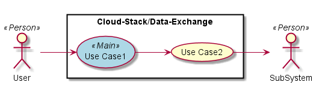
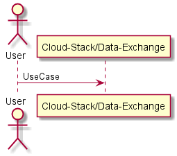
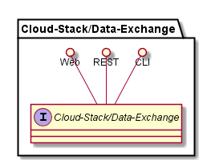
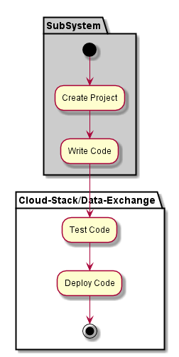
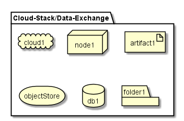

.. _SubSystem-Data-Exchange:

Data Exchange
=============

Data Exchange is a subsystem of Cloud Stack of the Automotive Data Center.
The Data Exchange gives the ability to establish policies per locations/Data Center that
limits the data that can be accessed by a authenticated user. Data does not move to the
user, but gives the user the ability to run snippets of code (widgets) in the specified
Data Center.

Aggregation of data for the authenticated user is done from all of the data centers.

Use Cases
---------

*

Users
-----

* :ref:`Actor-User`

Uses
----

* :ref:`Cloud-Stack/Data-Exchange`

Interface
---------

* CLI - Command Line Interface
* REST-API -
* Portal - Web Portal

Logical Artifacts
-----------------

*

Activities and Flows
--------------------

Deployment Architecture
-----------------------

Physical Architecture
---------------------

.. image:: Physical.png

