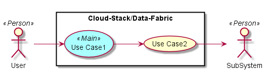
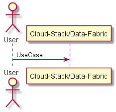
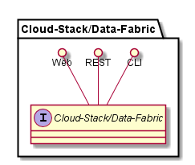
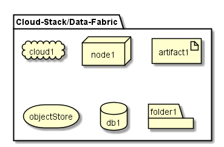

.. _Cloud-Stack/Data-Fabric:

Cloud-Stack/Data-Fabric
============

Cloud-Stack/Data-Fabric is a subsystem of adc ...

Use Cases
---------

*

Users
-----

* :ref:`Actor-User`

Uses
----

* :ref:`Cloud-Stack/Data-Fabric`

Interface
---------

* CLI - Command Line Interface
* REST-API -
* Portal - Web Portal

Logical Artifacts
-----------------

*

Activities and Flows
--------------------

.. image::  Process.png

Deployment Architecture
-----------------------

Physical Architecture
---------------------

.. image:: Physical.png

