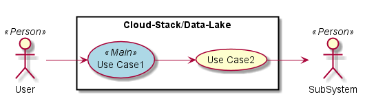
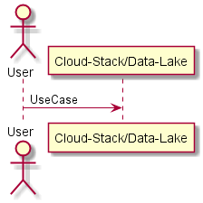
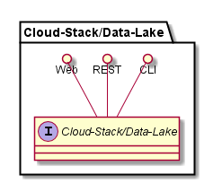
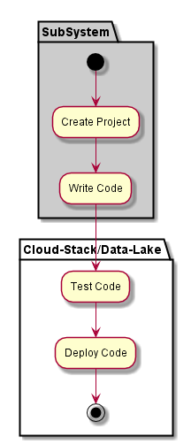
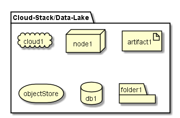
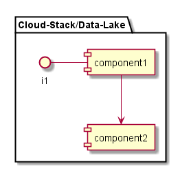

.. _SubSystem-Data-Lake:

Data Lake
=========

Cloud-Stack/Data-Lake is a subsystem of adc ...

Use Cases
---------

*

Users
-----

* :ref:`Actor-User`

Uses
----

* :ref:`Cloud-Stack/Data-Lake`

Interface
---------

* CLI - Command Line Interface
* REST-API -
* Portal - Web Portal

Logical Artifacts
-----------------

*

Activities and Flows
--------------------

Deployment Architecture
-----------------------

Physical Architecture
---------------------

