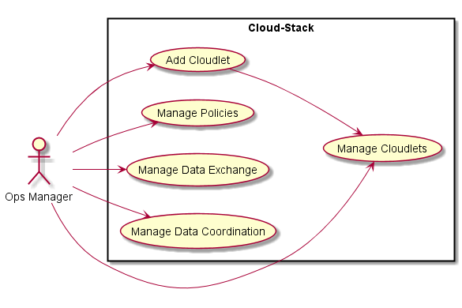
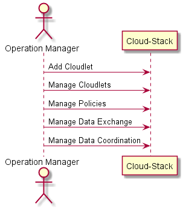
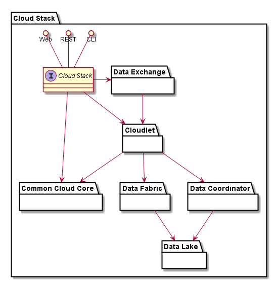
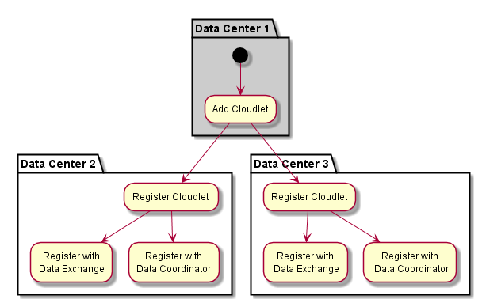
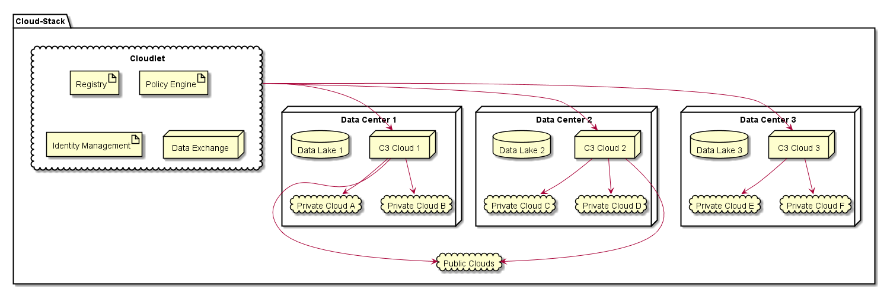
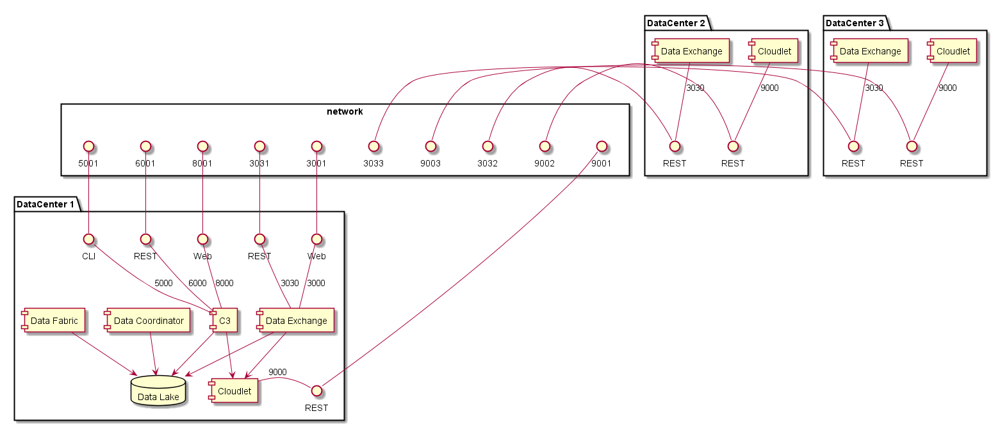

.. _SubSystem-Cloud-Stack:

Cloud Stack
===========

Cloud Stack is a subsystem of Automotive Data Center connects multiple data centers and public cloud
together. This abstracts the hardware away from the application and service layer. The Cloud
Stack utilizes the :ref:`SubSystem-Common-Cloud-Core` and the :ref:`SubSystem-Cloudlet` to give a federated hybrid cloud
layer for the Applications in the Data Center.

Use Cases
---------

* :ref:`UseCase-Manage-Cloudlets`
* :ref:`UseCase-Manage-Policies`
* :ref:`UseCase-Manage-Data-Exchange`
* :ref:`UseCase-Manage-Data-Coordination`

Users
-----

* :ref:`Actor-User`
* :ref:`Actor-Operation-Manager`

The Operations Manager uses the `Common Cloud Core <http://c3.readthedocs.io>`_C3/wiki) and the
`Cloudlet <http://cloudlet.readthedocs.io>`_ architectures to build a base of
the Cloud Stack.

Uses
----

* :ref:`Hardware-Stack`

Interface
---------

* CLI - Command Line Interface
* REST-API -
* Portal - Web Portal

Logical Artifacts
-----------------

.. toctree::
    :glob:
    :maxdepth: 1

    */SubSystem*

Activities and Flows
--------------------

When a Data Center is brought online it registers itself with the Federated CLoud architecture
using the `Cloudlet <http://cloudlet.readthedocs.io>`_ architecture. When the
Data Center registers to the Federation it also connects the Data Exchange Federation and
Data Coordination so Information can flow between the data Centers based on policies that
have been established at each Data Center.

Deployment Architecture
-----------------------

The Automotive Data Center spans multiple data centers and needs to an architecture that
connects the data centers so they can be managed together and applications can span multiple
data centers. The `Cloudlet <http:/cloudlet.readthedocs.io>`_ architecture is used to aid in
the connectivity across Data Centers.

In this case each data center has some common elements which include a Data Lake, a Hybrid Cloud
Orchestrator (C3), and connectivity to public and private clouds.

Physical Architecture
---------------------

In this example Data Center Build out there are 3 data centers that are connected
using the Cloudlet Architecture. Details of the
`Cloudlet architecture is here <http://cloudlet.readthedocs.io>`_
A common network interface between the 3 Data Centers.

