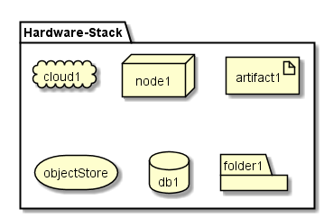

.. _SubSystem-Hardware-Stack:

Hardware Stack
==============

Hardware Stack is a subsystem of Automotive Data Center and includes the definition of
a small set of rack configurations, switch and storage for the applications running
in the data center.

Use Cases
---------

*

Users
-----

* :ref:`Actor-User`

Uses
----

* :ref:`Hardware-Stack`

Interface
---------

* CLI - Command Line Interface
* REST-API -
* Portal - Web Portal

Logical Artifacts
-----------------

*

Activities and Flows
--------------------

Deployment Architecture
-----------------------

Physical Architecture
---------------------

