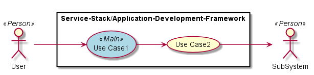
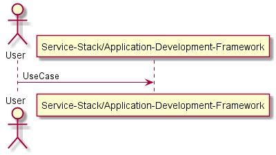
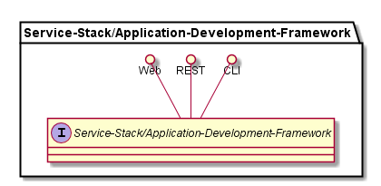
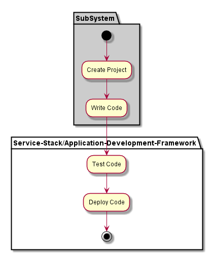
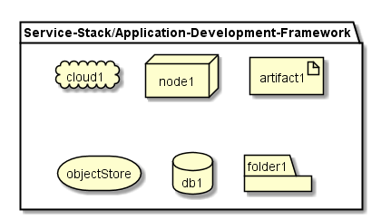
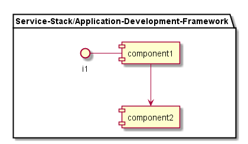

.. _SubSystem-Application-Development-Framework:

SubSystem Application Development Framework
===========================================

Application Development Framework is a subsystem of Service Stack of the Automotive Data Center.
The framework gives the Application Developer the ability to develop new services and applications
reusing existing services.

The application framework should include patterns and guidelines to developer applications
for the Automotive Data Center.

Use Cases
---------

*

Users
-----

* :ref:`Actor-User`

Uses
----

* :ref:`Service-Stack/Application-Development-Framework`

Interface
---------

* CLI - Command Line Interface
* REST-API -
* Portal - Web Portal

Logical Artifacts
-----------------

*

Activities and Flows
--------------------

Deployment Architecture
-----------------------

Physical Architecture
---------------------

