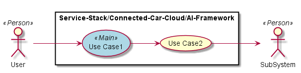
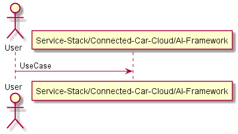
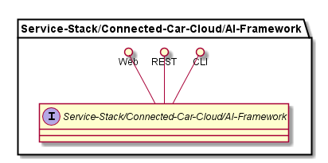
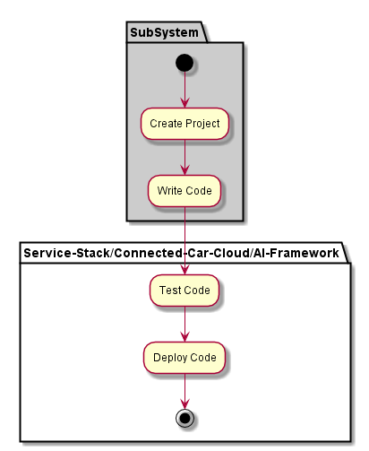
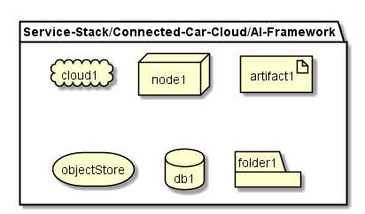
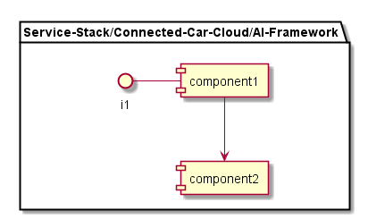

.. _SubSystem-AI-Framework:

AI Framework
============

Artificial Intelligence Framework is a subsystem of Service Stack of the Automotive Data Center.
The AI Framework allows applications to "Learn" from data in the data center.

Use Cases
---------

*

Users
-----

* :ref:`Actor-User`

Uses
----

* :ref:`SubSytem-AI-Framework`

Interface
---------

* CLI - Command Line Interface
* REST-API -
* Portal - Web Portal

Logical Artifacts
-----------------

*

Activities and Flows
--------------------

Deployment Architecture
-----------------------

Physical Architecture
---------------------

