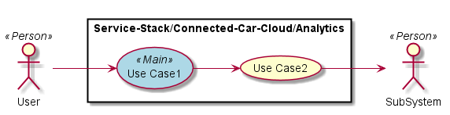
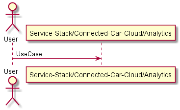
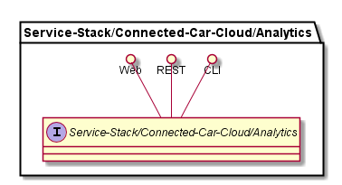
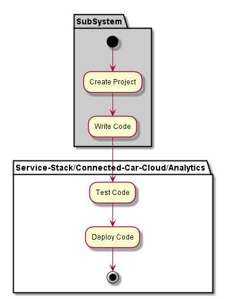
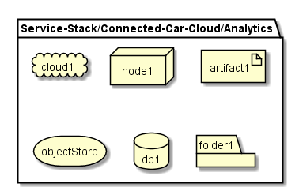
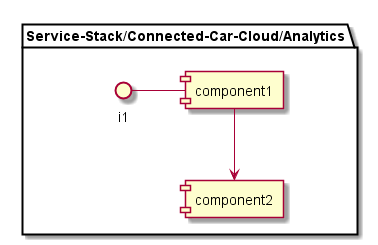

.. _SubSystem-Analytics:

SubSystem Analytics
===================

Analytics is a subsystem of Cloud Connected Car of the Automotive Data Center.
Analytics will clean and link the data.

Use Cases
---------

*

Users
-----

* :ref:`Actor-User`

Uses
----

* :ref:`SubSystem-Analytics`

Interface
---------

* CLI - Command Line Interface
* REST-API -
* Portal - Web Portal

Logical Artifacts
-----------------

*

Activities and Flows
--------------------

Deployment Architecture
-----------------------

Physical Architecture
---------------------

