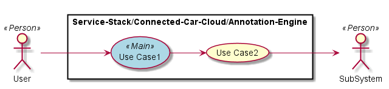

.. _SubSystem-Annotation-Engine:

SubSystem Annotation Engine
===========================

Annotation Engine is a subsystem of Connected Car Cloud of the Automotive Data Center.
The Annotation Engine adds meta-data to the data streamed into the Data Center from the
Vehicle.

Use Cases
---------

*

Users
-----

* :ref:`Actor-User`

Uses
----

* :ref:`SubSystem-Annotation-Engine`

Interface
---------

* CLI - Command Line Interface
* REST-API -
* Portal - Web Portal

Logical Artifacts
-----------------

*

Activities and Flows
--------------------

Deployment Architecture
-----------------------

Physical Architecture
---------------------

