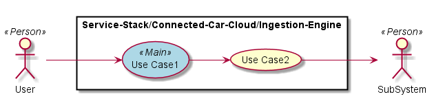

.. _SubSystem-Ingestion-Engine:

Ingestion Engine
================

Ingestion Engine is a subsystem of Connected Car Cloud of the Automotive Data Center.
Ingestion Engine is how data comes into the Data Center from the Car. The Ingestion Engine
should handle messages of several different message size but average should be about
200 KBytes.

Use Cases
---------

*

Users
-----

* :ref:`Actor-User`

Uses
----

* :ref:`SubSystem-Ingestion-Engine`

Interface
---------

* CLI - Command Line Interface
* REST-API -
* Portal - Web Portal

Logical Artifacts
-----------------

*

Activities and Flows
--------------------

Deployment Architecture
-----------------------

Physical Architecture
---------------------

