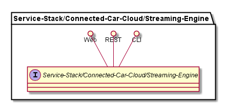

.. _SubSystem-Streaming-Engine:

Streaming Engine
================

Streaming Engine is a subsystem of Cloud Connected Car of the Automotive Data Center.
The Streaming Engine connects the Ingestion Engine to the Connection Services specifically
the Alert and Notification Gateways.

Use Cases
---------

*

Users
-----

* :ref:`Actor-Operations-Manager`

Uses
----

* :ref:`Subsystem-Streaming-Engine`

Interface
---------

* CLI - Command Line Interface
* REST-API -
* Portal - Web Portal

Logical Artifacts
-----------------

*

Activities and Flows
--------------------

Deployment Architecture
-----------------------

Physical Architecture
---------------------

