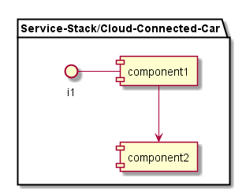

.. _SubSystem-Connected-Car-Cloud:

Connected Car Cloud
===================

Cloud Connected Car is a subsystem of the Service Stack in the Automotive Data Center.
The Cloud Connected Car is contains services that connect the car to the Data Center,
transform data, learn from the data, store the data and stream the data to the
Connection Services.

Use Cases
---------

*

Users
-----

* :ref:`Actor-Operations-Manager`

Uses
----

* :ref:`SubSystem-Connected-Car-Cloud`

Interface
---------

* CLI - Command Line Interface
* REST-API -
* Portal - Web Portal

Logical Artifacts
-----------------

.. toctree::
    :glob:
    :maxdepth: 1

    */SubSystem*

Activities and Flows
--------------------

Deployment Architecture
-----------------------

Physical Architecture
---------------------

