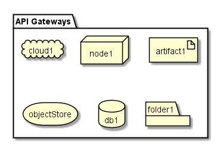

.. _SubSystem-API-Gateways:

API Gateways
============

Service-Stack/Connection-Services/API-Gateways is a subsystem of adc ...

Use Cases
---------

*

Users
-----

* :ref:`Actor-User`

Uses
----

* :ref:`SubSystem-API-Gateways`

Interface
---------

* CLI - Command Line Interface
* REST-API -
* Portal - Web Portal

Logical Artifacts
-----------------

* :ref:`SubSystem-API-Gateways`
* :ref:`SubSystem-Feedback-Gateway`
* :ref:`SubSystem-Notification-Gateway`

Activities and Flows
--------------------

.. image::  Process.png

Deployment Architecture
-----------------------

Physical Architecture
---------------------

