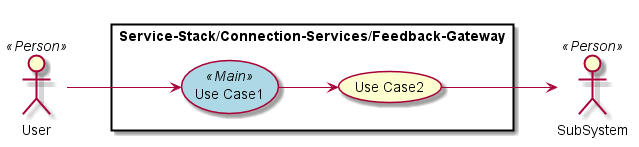

.. _SubSystem-Feedback-Gateway:

Feedback Gateway
================

Feedback Gateway is a subsystem of Connection Services of the Automotive Data Center.
The Feedback Gateway connects the Data Center back to the car that messages originally
came through the Automotive Data Center.

Use Cases
---------

*

Users
-----

* :ref:`Actor-Operations-Manager`

Uses
----

* :ref:`SubSystem-Feedback-Gateway`

Interface
---------

* CLI - Command Line Interface
* REST-API -
* Portal - Web Portal

Logical Artifacts
-----------------

*

Activities and Flows
--------------------

Deployment Architecture
-----------------------

Physical Architecture
---------------------

