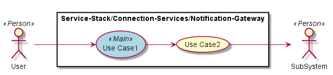
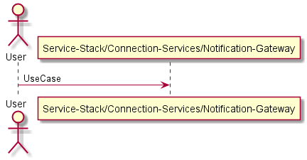
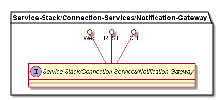
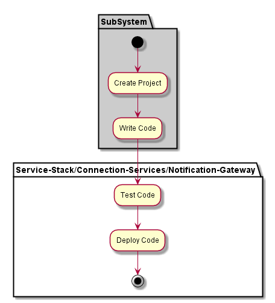
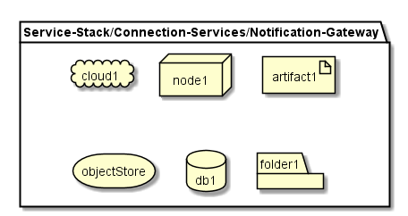
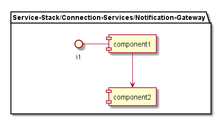

.. _SubSystem-Notification-Gateway:

SubSystem Notification Gateway
==============================

Notification Gateway is a subsystem of Connection Services of the Automotive Data Center.
The Notification Gateway connects external Systems that are "Notified" when specific events
happen in the data center. They can subscribe to specific events based on criteria established
through the Notification Gateway. A snippet of code can run in the data center that
publishes events to the pubsub bus.

Use Cases
---------

*

Users
-----

* :ref:`Actor-User`

Uses
----

* :ref:`SubSystem-Notification-Gateway`

Interface
---------

* CLI - Command Line Interface
* REST-API -
* Portal - Web Portal

Logical Artifacts
-----------------

*

Activities and Flows
--------------------

Deployment Architecture
-----------------------

Physical Architecture
---------------------

