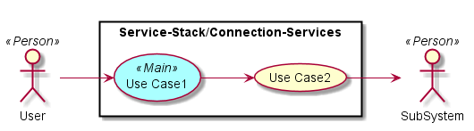
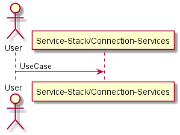
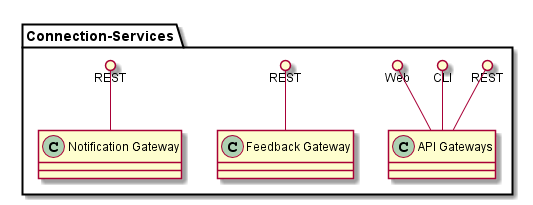
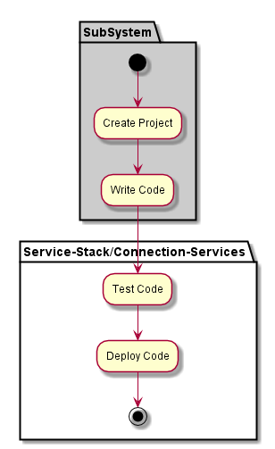
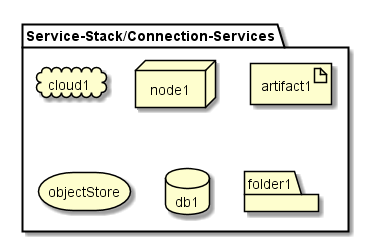
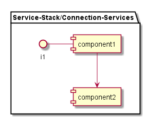

.. _SubSystem-Connection-Services:

Connection Services
===================

Connection Services is a subsystem of the Service Stack in the ADC Architecture.

Use Cases
---------

*

Users
-----

* :ref:`Actor-User`

Uses
----

* :ref:`Service-Stack/Connection-Services`

Interface
---------

* CLI - Command Line Interface
* REST-API -
* Portal - Web Portal

Logical Artifacts
-----------------

.. toctree::
    :glob:
    :maxdepth: 1

    */SubSystem*

Activities and Flows
--------------------

Deployment Architecture
-----------------------

Physical Architecture
---------------------

