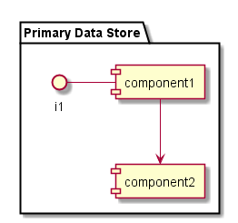

.. _SubSystem-Primary-Data-Store:

Primary Data Store
==================

Primary Data Store is a subsystem of Storage Services of the Automotive Data Center.
The Primary Data Store is used for the API Gateway, Notification Gateway and AI Framework.
The Primary Data Store should be the most prevalent data for the applications in the Data
Center.

Use Cases
---------

*

Users
-----

* :ref:`Actor-Operations-Manager`

Uses
----

* :ref:`SubSystem-Primary-Data-Store`

Interface
---------

* CLI - Command Line Interface
* REST-API -
* Portal - Web Portal

Logical Artifacts
-----------------

*

Activities and Flows
--------------------

Deployment Architecture
-----------------------

Physical Architecture
---------------------

