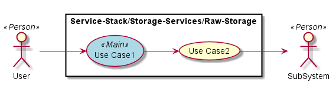

.. _SubSystem-Raw-Storage:

Raw Storage
===========

Raw Storage is a subsystem of Storage Services of the Automotive Data Center.
The Raw Storage stores the raw data coming in from the cars. The data is a replica of the
data directly from the Vehicles.

Use Cases
---------

*

Users
-----

* :ref:`Actor-Operations-Manager`

Uses
----

* :ref:`SubSystem-Raw-Storage`

Interface
---------

* CLI - Command Line Interface
* REST-API -
* Portal - Web Portal

Logical Artifacts
-----------------

*

Activities and Flows
--------------------

Deployment Architecture
-----------------------

Physical Architecture
---------------------

