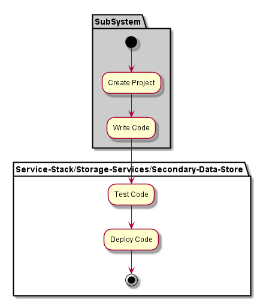

.. _SubSystem-Secondary-Data-Store:

SubSystem Secondary Data Store
==============================

Secondary Data Store is a subsystem of Storage Services of the Automotive Data Center.
Secondary Data Store is used for the API Gateway and contains Derived data from analytics
and AI Framework. There maybe several Secondary Data Store Services.

Use Cases
---------

*

Users
-----

* :ref:`Actor-User`

Uses
----

* :ref:`SubSystem-Secondary-Data-Store`

Interface
---------

* CLI - Command Line Interface
* REST-API -
* Portal - Web Portal

Logical Artifacts
-----------------

*

Activities and Flows
--------------------

Deployment Architecture
-----------------------

Physical Architecture
---------------------

