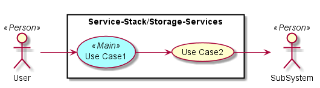
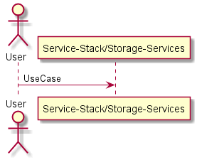
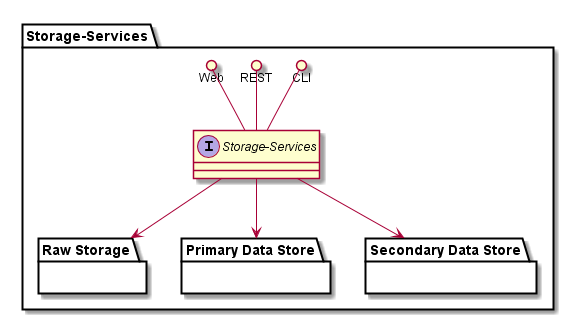
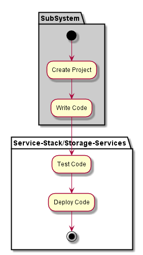
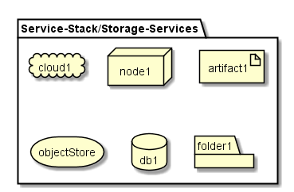
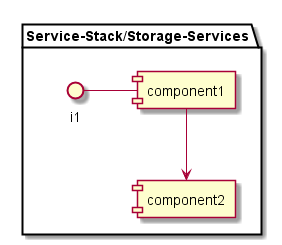

.. _SubSystem-Storage-Services:

SubSystem-Storage-Services
==========================
Storage Services is a subsystem of Service Stack of the Automotive Data Center.
This include Storage Services for Raw Storage, Primary and Secondary Storage.
This should leverage the :ref:`SubSystem-Data-Lake` of the :ref:`SubSystem-Cloud-Stack`.

Use Cases
---------

*

Users
-----

* :ref:`Actor-Operations-Manager`

Uses
----

* :ref:`SubSystem-Storage-Services`

Interface
---------

* CLI - Command Line Interface
* REST-API -
* Portal - Web Portal

Logical Artifacts
-----------------

* :ref:`SubSystem-Primary-Data-Store`
* :ref:`SubSystem-Secondary-Data-Store`
* :ref:`SubSystem-Raw-Storage`

Activities and Flows
--------------------

Deployment Architecture
-----------------------

Physical Architecture
---------------------

