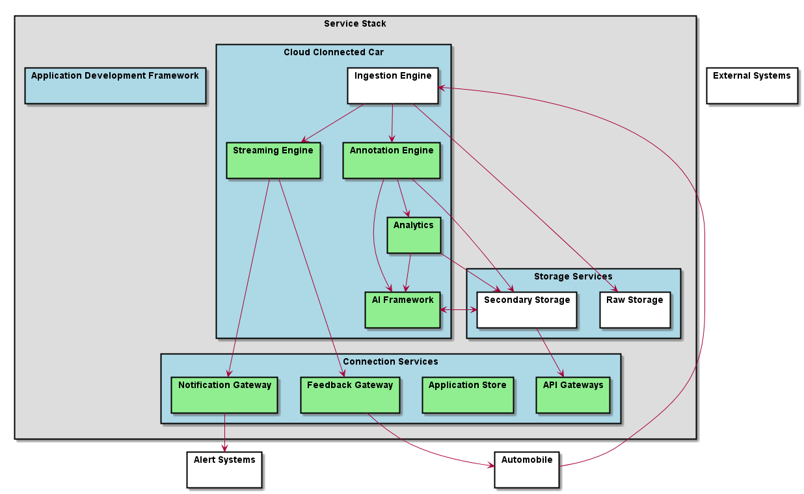

.. _SubSystem-Service-Stack:

Service Stack
=============

Service Stack is a subsystem of Automotive Data Center.
It contains the services for the Automotive Data Center that provides frameworks to develope new
applications for the automotive industry. The Services Stack is built to work on top of the
:ref:`SubSystem-Cloud-Stack`.

Use Cases
---------

*

Users
-----

* :ref:`Actor-Operations-Manager`

Uses
----

* :ref:`SubSystem-Service-Stack`

Interface
---------

* CLI - Command Line Interface
* REST-API -
* Portal - Web Portal

Logical Artifacts
-----------------

.. toctree::
    :glob:
    :maxdepth: 1

    */SubSystem*

Activities and Flows
--------------------

Deployment Architecture
-----------------------

Physical Architecture
---------------------

.. image:: Physical.png

