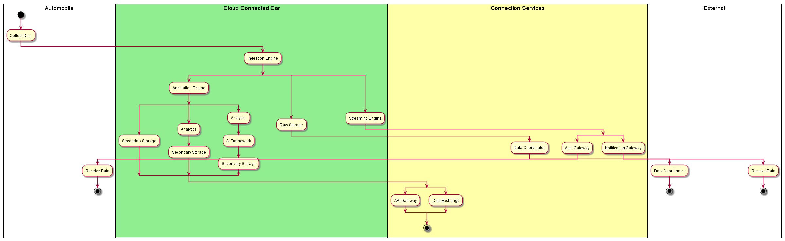

Automotive Data Center
======================

The Automotive Data Center is developed to handle new and existing use cases of the automotive
industry include but not limited to Autonomous Driving (ADAS), Telemetry, Alert Systems, and
new usage models that have not been yet developed to monetize data.

Actors
------

.. toctree::
    :glob:
    :maxdepth: 1

    Actor/index

High level Use Cases
--------------------
.. toctree::
    :glob:
    :maxdepth: 1

    UseCase/index

.. image:: UseCases.png

High Level Overview
-------------------

.. image:: Overview.png

:ref:`SubSystem-Service-Stack`
~~~~~~~~~~~~~~~~~~~~~~~~~~~~~~

* :ref:`SubSystem-Cloud-Connected-Car` - (Ingestion, Annotation, Streaming, Data Storage)
* Specialized Applications (ADAS, Telematics, IVI, Dynamic Mapping)
* :ref:`SubSystem-Analytics`, :ref:`SubSystem-AI-Framework`
* :ref:`SubSystem-Connection-Services` to External Applications and data sources

:ref: `SubSystem-Cloud-Stack`
~~~~~~~~~~~~~~~~~~~~~~~~~~~~~

* Cloudlet (Multi-cloud) connectivity
* Hybrid Cloud for connectivity between private and public Clouds.
* Software Define Infrastructure (Compute, Storage and Network)
* Data Lake (Hot, Warm and Cold Storage)

:ref:`SubSystem-Hardware-Stack`
~~~~~~~~~~~~~~~~~~~~~~~~~~~~~~~

* Cloud Scalable Units (Scale Out General Cloud Racks)
* High Performance Scalable Units ( Specialized HPC hardware)
* Data Scalable Units (Scalable for Hot, Warm and Cold Storage)
* RSD Composible Architecture

Logical Architecture
--------------------

The key input of data to Automotive Data Center is the Automobile. Data from the car is ingested into the data center
through the ingestion engine. From there data is cleansed, analyzed, and multiple paths of data can be created
depending on the applications being developed. Connection services allow for external
systems to utilize the data both derived and raw.

.. image:: Logical.png

Process Architecture
--------------------
As data flows through the system different microservices modify or cleanse the data and then
it is stored in the Raw Storage or in Primary and Secondary Data Stores depending on the applications
being created for the Automotive Data Center.

Deployment model
----------------

The solution is deployed over multiple clouds in multiple data centers across the world.
The Cloud Stack provides the federation of clouds so that vehicles can connect to the
geographically nearest data center. As the car moves between geographies the data from that
car will be held in the data center. Due to government regulations and changes in those
regulations the infrastructure needs to be flexible to handle the movement of data and or the
exchange of data if data soverienty is an issue.

In this architecture the ability to leverage public cloud for external application connective
decouples the data center from external threat and connectivity. This decoupling gives another
level of security for the data center.

.. image:: Deployment.png

Physical Architecture
---------------------

The Service Stack sits on top of the federated cloud. This allows the cloud stack to determine the best location
to run services. The Cloud stack federates multiple clouds together including public clouds for external application
connective and development. The Private clouds in each data center are made up of common reusable stacks. These standard
racks of machines come in multiple flavors of racks that can be tailored for specific services. Generally we would like
all of the rack in the data center to be identical, but in reality that may not be the case.

.. image:: Physical.png

