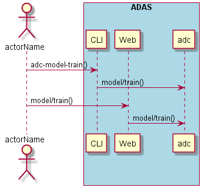
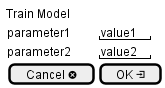

.. _Scenario-Train-Model:

Train Model
===========

Train Model using CLI and Web Interface with ... <parameters>

**CLI**

This is the command line interface for the Train Model Scenario.

.. code-block:: none

  # adc model train <parameters>
  # adc model train exmaple

**Web Interface**

This is a mock up of the Web Interface for the Train Model Scenario.

**REST**

This is the RESTful interface for the scenario.

*model/train*

============  ========  ===================
Name          Value     Description
------------  --------  -------------------
parameter1    value1    Description1
============  ========  ===================
