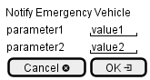

.. _Scenario-Notify-Emergency-Vehicle:

Notify Emergency Vehicle
========================

Notify Emergency Vehicle using CLI and Web Interface with ... <parameters>

**CLI**

This is the command line interface for the Notify Emergency Vehicle Scenario.

.. code-block:: none

  # adc emergency notify <parameters>
  # adc emergency notify exmaple

**Web Interface**

This is a mock up of the Web Interface for the Notify Emergency Vehicle Scenario.

**REST**

This is the RESTful interface for the scenario.

*emergency/notify*

============  ========  ===================
Name          Value     Description
------------  --------  -------------------
parameter1    value1    Description1
============  ========  ===================
