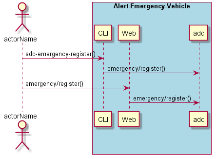
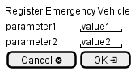

.. _Scenario-Register-Emergency-Vehicle:

Register Emergency Vehicle
==========================

Register Emergency Vehicle using CLI and Web Interface with ... <parameters>

**CLI**

This is the command line interface for the Register Emergency Vehicle Scenario.

.. code-block:: none

  # adc emergency register <parameters>
  # adc emergency register exmaple

**Web Interface**

This is a mock up of the Web Interface for the Register Emergency Vehicle Scenario.

**REST**

This is the RESTful interface for the scenario.

*emergency/register*

============  ========  ===================
Name          Value     Description
------------  --------  -------------------
parameter1    value1    Description1
============  ========  ===================
