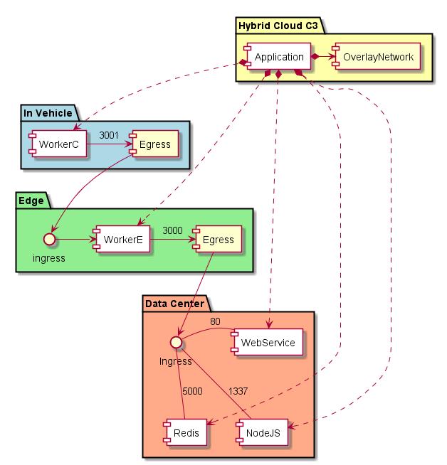

.. _Scenario-Deploy-Complex-Application-DC,-Edge,-and-Vehicle:

Deploy Complex Application DC, Edge, and Vehicle
================================================
An application can be complex and and have services running in the Data Center, Edge and in Vehicle.
In this example an application has several services running in the data center and one service running
in the edge and one running in the vehicle. Note that there can be several different edge devices and vehicles, but
the diagram shows one for simplicity.

An application definition has information about the application and possible location of where to place the services
that make up the application. Ultimately the decision on where to place the services of the application is the
responsibility of the :ref:`SubSystem-Common-Cloud-Core`_.

When an application is created it will provision an overlay network (or something similar) and services in the data center, edge and vehicle dependent on policies
of the :ref:`Common Cloud Core`_. After the application has been created it can function by moving data through
the created network from Vehicle -> Edge -> Data Center.

.. image:: Deploy-Complex-Application-DC,-Edge,-and-Vehicle.png

