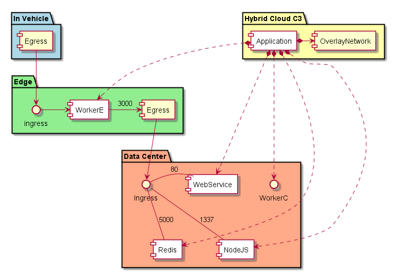

.. _Scenario-Deploy-Complex-Application-DC-and-Edge:

Deploy Complex Application DC and Edge
======================================
An application can be complex and and have services running in the Data Center and Edge.
In this example an application has several services running in the data center and one service running
in the edge. Note that there can be several different edge devices, but
the diagram shows one for simplicity.

When an application is created it will provision an overlay network (or something similar) and services in the
data center and an edge dependent on policies of the :ref:`Common Cloud Core`_. After the application has been
created it can function by moving data through the created network from Vehicle -> Edge -> Data Center.

