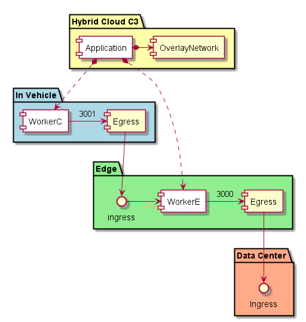
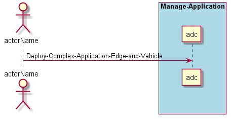

.. _Scenario-Deploy-Complex-Application-Edge-and-Vehicle:

Deploy Complex Application Edge and Vehicle
===========================================

An application can be complex and and have services running in the Edge and in Vehicle.
In this example an application has several services running in the in the edge and one running in the vehicle.
Note that there can be several different edge devices and vehicles, but the diagram shows one for simplicity.

An application definition has information about the application and possible location of where to place the services
that make up the application. Ultimately the decision on where to place the services of the application is the
responsibility of the :ref:`SubSystem-Common-Cloud-Core`.

