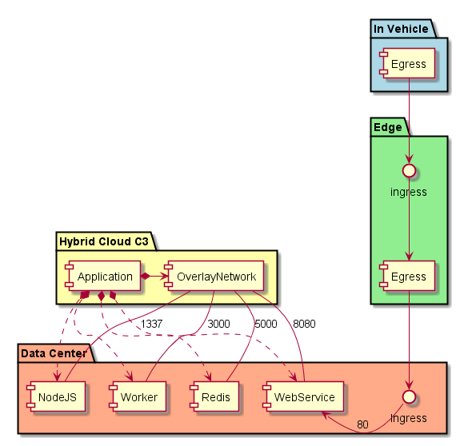
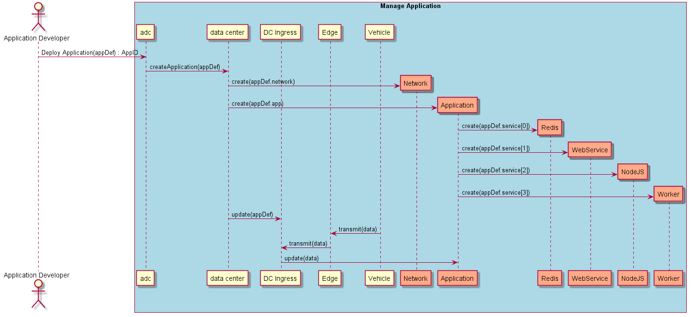

.. _Scenario-Deploy-Simple-Application-in-DC:

Deploy Simple Application in DC
===============================

A simple application has multiple services that run in the data center based off of data coming from the car via the edge.

An application definition has information about the application and possible location of where to place the services
that make up the application. Ultimately the decision on where to place the services of the application is the
responsibility of the :ref:`SubSystem-Common-Cloud-Core`_.

