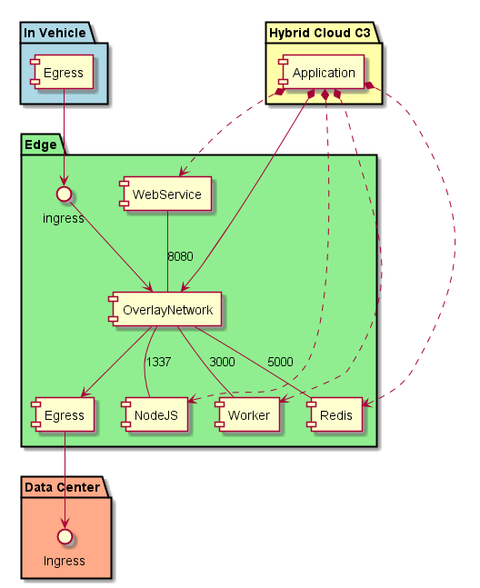

.. _Scenario-Deploy-Simple-Application-in-Edge:

Deploy Simple Application in Edge
=================================
A simple application has multiple services that run in the edge based off of data coming from the car.

An application definition has information about the application and possible location of where to place the services
that make up the application. Ultimately the decision on where to place the services in the edge of the application is the
responsibility of the :ref:`SubSystem-Common-Cloud-Core`_. Not all edge devices may have these services.

.. image:: Deploy-Simple-Application-in-Edge.png

