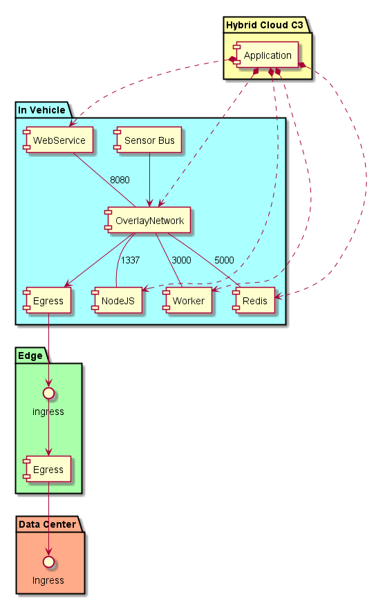
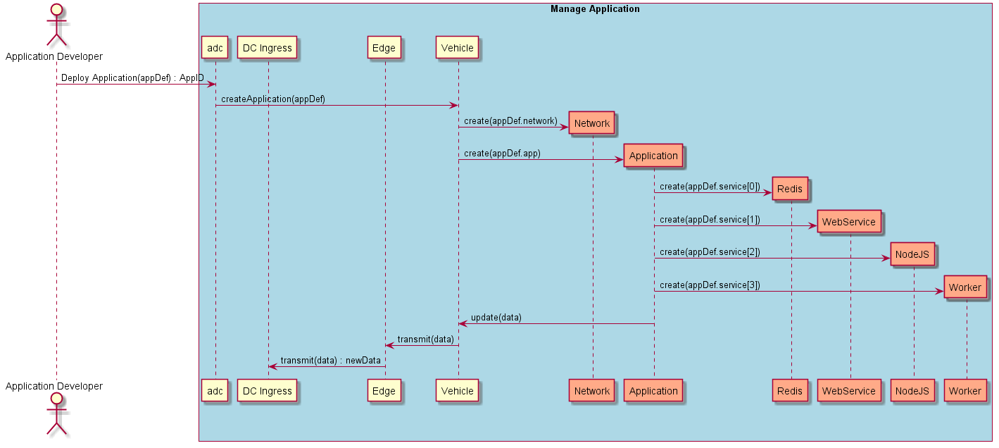

.. _Scenario-Deploy-Simple-Application-in-Vehicle:

Deploy Simple Application in Vehicle
====================================
A simple application has multiple services that run in the vehicle based off of data coming the sensor bus.
Results are sent to the edge and then to the data center.

An application definition has information about the application and possible location of where to place the services
that make up the application. Ultimately the decision on where to place the services in the Vehicle of the application
is the responsibility of the :ref:`SubSystem-Common-Cloud-Core`. Not all vehicles may have these services. Vehicles
have different characteristics that can be used to determine which services get placed on which vehicles. It could be
location, make, model, mileage, etc...

