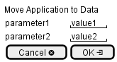

.. _Scenario-Move-Application-to-Data:

Move Application to Data
========================

Move Application to Data using CLI and Web Interface with ... <parameters>

**CLI**

This is the command line interface for the Move Application to Data Scenario.

.. code-block:: none

  # adc application move <parameters>
  # adc application move exmaple

**Web Interface**

This is a mock up of the Web Interface for the Move Application to Data Scenario.

**REST**

This is the RESTful interface for the scenario.

*application/move*

============  ========  ===================
Name          Value     Description
------------  --------  -------------------
parameter1    value1    Description1
============  ========  ===================
