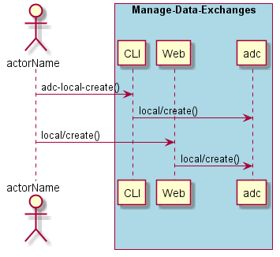
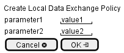

.. _Scenario-Create-Local-Data-Exchange-Policy:

Create Local Data Exchange Policy
=================================

Create Local Data Exchange Policy using CLI and Web Interface with ... <parameters>

**CLI**

This is the command line interface for the Create Local Data Exchange Policy Scenario.

.. code-block:: none

  # adc local create <parameters>
  # adc local create exmaple

**Web Interface**

This is a mock up of the Web Interface for the Create Local Data Exchange Policy Scenario.

**REST**

This is the RESTful interface for the scenario.

*local/create*

============  ========  ===================
Name          Value     Description
------------  --------  -------------------
parameter1    value1    Description1
============  ========  ===================
