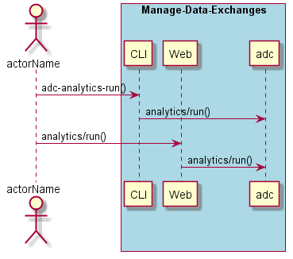
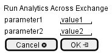

.. _Scenario-Run-Analytics-Across-Exchange:

Run Analytics Across Exchange
=============================

Run Analytics Across Exchange using CLI and Web Interface with ... <parameters>

**CLI**

This is the command line interface for the Run Analytics Across Exchange Scenario.

.. code-block:: none

  # adc analytics run <parameters>
  # adc analytics run exmaple

**Web Interface**

This is a mock up of the Web Interface for the Run Analytics Across Exchange Scenario.

**REST**

This is the RESTful interface for the scenario.

*analytics/run*

============  ========  ===================
Name          Value     Description
------------  --------  -------------------
parameter1    value1    Description1
============  ========  ===================
