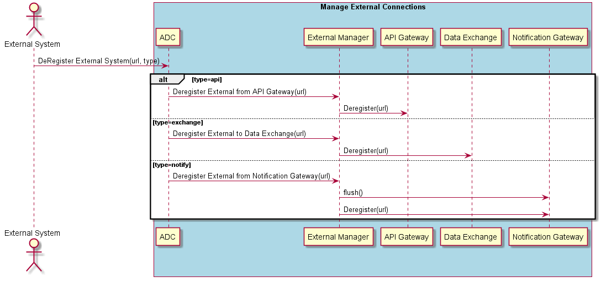

.. _Scenario-Deregister-External-System:

Deregister External System
==========================
This deregisters the External System from the ADC. It takes a type of external system and calls the appropriate
Connection Service Sub-system (:ref:`SubSystem-API-Gateways`, :ref:`SubSystem-Notification-Gateway`, :ref:`SubSystem-Data-Exchange`).

