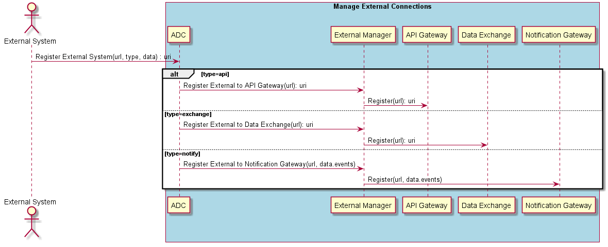

.. _Scenario-Register-External-System:

Register External System
========================

This registers an external system with the specific type of registration (notify,exchange,api).
If the type is not specified api is assumed. For data exchange and api types a URI end point is returned.
For the Registration of an external system with type=notify. A data structure with the list of events to be notified
and the uri endpoints for each type of event will be passed into the registration call.

Example of Notification Data Structure
~~~~~~~~~~~~~~~~~~~~~~~~~~~~~~~~~~~~~~

.. code-block: none

  event-name:
      endpoint: http://external/event-name
  event-name2:
      endpoint: http://external/event-name2

