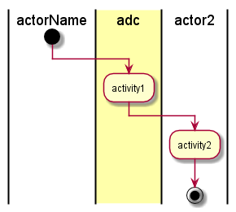

.. _UseCase-Manage-Infrastructure:

Manage Infrastructure
=====================

Manage Infrastructure is a use case that allows the Operations Manager the ability to manage
the infrastructure in the Data Center.

Actors
------

* _Actors_

Activities
----------

* _Activities_

Systems Involved
----------------

* _Systems_

