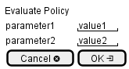

.. _Scenario-Evaluate-Policy:

Evaluate Policy
===============

Evaluate Policy using CLI and Web Interface with ... <parameters>

**CLI**

This is the command line interface for the Evaluate Policy Scenario.

.. code-block:: none

  # adc policy evaluate <parameters>
  # adc policy evaluate exmaple

**Web Interface**

This is a mock up of the Web Interface for the Evaluate Policy Scenario.

**REST**

This is the RESTful interface for the scenario.

*policy/evaluate*

============  ========  ===================
Name          Value     Description
------------  --------  -------------------
parameter1    value1    Description1
============  ========  ===================
