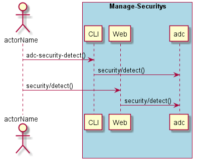
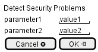

.. _Scenario-Detect-Security-Problems:

Detect Security Problems
========================

Detect Security Problems using CLI and Web Interface with ... <parameters>

**CLI**

This is the command line interface for the Detect Security Problems Scenario.

.. code-block:: none

  # adc security detect <parameters>
  # adc security detect exmaple

**Web Interface**

This is a mock up of the Web Interface for the Detect Security Problems Scenario.

**REST**

This is the RESTful interface for the scenario.

*security/detect*

============  ========  ===================
Name          Value     Description
------------  --------  -------------------
parameter1    value1    Description1
============  ========  ===================
