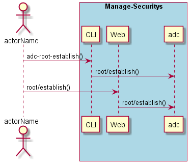
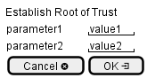

.. _Scenario-Establish-Root-of-Trust:

Establish Root of Trust
=======================

Establish Root of Trust using CLI and Web Interface with ... <parameters>

**CLI**

This is the command line interface for the Establish Root of Trust Scenario.

.. code-block:: none

  # adc root establish <parameters>
  # adc root establish exmaple

**Web Interface**

This is a mock up of the Web Interface for the Establish Root of Trust Scenario.

**REST**

This is the RESTful interface for the scenario.

*root/establish*

============  ========  ===================
Name          Value     Description
------------  --------  -------------------
parameter1    value1    Description1
============  ========  ===================
