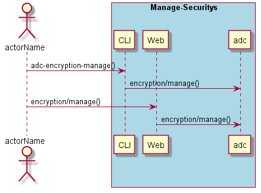
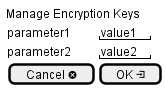

.. _Scenario-Manage-Encryption-Keys:

Manage Encryption Keys
======================

Manage Encryption Keys using CLI and Web Interface with ... <parameters>

**CLI**

This is the command line interface for the Manage Encryption Keys Scenario.

.. code-block:: none

  # adc encryption manage <parameters>
  # adc encryption manage exmaple

**Web Interface**

This is a mock up of the Web Interface for the Manage Encryption Keys Scenario.

**REST**

This is the RESTful interface for the scenario.

*encryption/manage*

============  ========  ===================
Name          Value     Description
------------  --------  -------------------
parameter1    value1    Description1
============  ========  ===================
