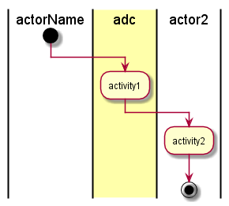

.. _UseCase-Manage-Services:

Use Case Manage Services
========================

Manage Services is a use case that allows the Stack Developer and Operations Manager manage
services in the Data Center.

Actors
------

* :ref:`Actor-Operations-Manager`
* :ref:`Actor-Stack-Developer`

Activities
----------

* _Activities_

Detail Scenarios
----------------

.. toctree::
   :glob:
   :maxdepth: 1

   Scenario*

Systems Involved
----------------

* _Systems_

